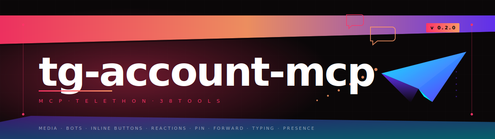

# tg-account-mcp

<p align="center"></p>

An MCP server that wraps [Telethon](https://github.com/LonamiWebs/Telethon) so Claude Code (or any MCP client) can drive your **personal Telegram account** over MTProto — chats, media, bots, reactions, groups, the lot.

> ⚠️ This drives a *user account*, not a bot. Aggressive automation can get the account limited or banned by Telegram. Read the safety notes below before pointing it at anything noisy.

[](https://github.com/kroch228/tg-account-mcp/actions/workflows/ci.yml) · [MIT](LICENSE) · Python 3.11+

## Stack

- **Server:** Python 3.11+, [`mcp`](https://pypi.org/project/mcp/) (low-level `Server` over `stdio`)
- **Telegram:** [`telethon`](https://pypi.org/project/Telethon/) ≥ 1.36 (MTProto user session)
- **Config / secrets:** `python-dotenv` + env vars only — никаких хардкоженых ключей

38 tools registered, grouped into 5 blocks (см. ниже).

## Prerequisites

- Python 3.11+
- `api_id` / `api_hash` from [my.telegram.org/apps](https://my.telegram.org/apps)
- A phone number tied to a Telegram account
- Optional: `TG_2FA_PASSWORD` if 2FA is on

## Install

```bash
git clone https://github.com/kroch228/tg-account-mcp.git
cd tg-account-mcp
python -m venv .venv
source .venv/bin/activate          # fish: source .venv/bin/activate.fish
pip install -e ".[dev]"
cp .env.example .env
# Заполни TG_API_ID, TG_API_HASH, TG_PHONE (и TG_2FA_PASSWORD при 2FA)
```

## First-run auth

The MCP server hangs on first connection if the session is not authorised — авторизуйся **до** того, как подключаешь к Claude Code.

```bash
python -m tg_account_mcp.auth
```

Введёшь SMS-код (и пароль 2FA, если включён). Сессия ляжет в `.tg-session/user.session` (`chmod 600`, в `.gitignore`). Повторная авторизация не нужна, пока сессия не истекла.

## Register with Claude Code

```bash
claude mcp add tg-account -- python -m tg_account_mcp.server
```

Или через JSON-конфиг (`~/.config/claude/claude_desktop_config.json`):

```json
{
  "mcpServers": {
    "tg-account": {
      "command": "python",
      "args": ["-m", "tg_account_mcp.server"],
      "env": {
        "TG_API_ID": "12345678",
        "TG_API_HASH": "your_api_hash_here",
        "TG_PHONE": "+79001234567"
      }
    }
  }
}
```

После добавления перезапусти Claude Code — `tg_*` инструменты появятся в списке.

## Tools — overview

`dialog_id` принимает: numeric peer ID, `@username`, или `"me"` (Saved Messages). File paths — абсолютные или относительно cwd сервера. Везде, где ожидается медиа-файл, http(s) URL тоже работает.

### Block A — Media (10)

| Tool | Params | Returns |
|-|-|-|
| `tg_send_photo` | `dialog_id`, `file`, `caption?`, `reply_to?`, `silent?`, `parse_mode?` | `{id, date, chat_id}` |
| `tg_send_document` | `dialog_id`, `file`, `caption?`, `parse_mode?` | `{id, …}` |
| `tg_send_video` | `dialog_id`, `file`, `caption?`, `supports_streaming?`, `parse_mode?` | `{id, …}` |
| `tg_send_voice` | `dialog_id`, `file` | `{id, …}` |
| `tg_send_audio` | `dialog_id`, `file`, `caption?` | `{id, …}` |
| `tg_send_animation` | `dialog_id`, `file`, `caption?` | `{id, …}` |
| `tg_send_sticker` | `dialog_id`, `file` | `{id, …}` |
| `tg_send_media_group` | `dialog_id`, `files[1..10]`, `caption?` | `{ids, count}` |
| `tg_download_media` | `dialog_id`, `message_id`, `out_path?` | `{saved_path, media_kind, size}` |
| `tg_get_media_info` | `dialog_id`, `message_id` | `{media_kind, mime_type, size, duration, width, height, …}` |

### Block B — Bot interaction (4)

| Tool | Params | Returns |
|-|-|-|
| `tg_send_to_bot` | `bot`, `text`, `parse_mode?` | `{id, …}` |
| `tg_wait_bot_reply` | `bot`, `after_message_id?`, `timeout?`, `poll_interval?` | `message \| null` (с полем `keyboard`) |
| `tg_get_bot_keyboard` | `dialog_id`, `message_id` | `{has_buttons, keyboard: [[button]]}` |
| `tg_click_inline_button` | `dialog_id`, `message_id`, `text? \| data? \| row+col` | `{clicked, alert?, message?, url?}` |

`tg_wait_bot_reply` polls `get_messages(min_id=…)` каждые ~700 ms — не event-based, но контекст-aware: можно передать `after_message_id`, чтобы исключить уже виденные.

### Block C — Chats / messages (12)

| Tool | Params | Returns |
|-|-|-|
| `tg_list_dialogs` | `limit?`, `archived?` | `[{id, title, kind, unread_count, last_message_at}]` |
| `tg_read_history` | `dialog_id`, `limit?`, `offset_id?` | `[message]` |
| `tg_get_chat_info` | `dialog_id` | `{id, kind, title, username, …}` |
| `tg_send_message` | `dialog_id`, `text`, `reply_to?`, `silent?`, `parse_mode?`, `link_preview?` | `{id, date, chat_id}` |
| `tg_edit_message` | `dialog_id`, `message_id`, `text`, `parse_mode?` | `{ok}` |
| `tg_delete_message` | `dialog_id`, `message_ids`, `revoke?` | `{deleted}` |
| `tg_forward_messages` | `from_dialog`, `to_dialog`, `message_ids`, `silent?`, `drop_author?` | `{ids, count}` |
| `tg_search` | `query`, `dialog_id?`, `limit?` | `[message]` |
| `tg_mark_read` | `dialog_id`, `max_message_id?` | `{ok}` |
| `tg_pin_message` | `dialog_id`, `message_id`, `notify?`, `pm_oneside?` | `{ok, pinned_id}` |
| `tg_unpin_message` | `dialog_id`, `message_id?` | `{ok, unpinned_id\|"all"}` |
| `tg_get_pinned_messages` | `dialog_id`, `limit?` | `[message]` |

`parse_mode` — `"md"` / `"markdown"` / `"html"`.

### Block D — Reactions, users, groups, presence (12)

| Tool | Params | Returns |
|-|-|-|
| `tg_set_reaction` | `dialog_id`, `message_id`, `emoji`, `big?` | `{ok, emoji}` |
| `tg_get_message_reactions` | `dialog_id`, `message_ids` | `[{id, reactions:[{reaction, count}]}]` |
| `tg_list_contacts` | — | `[{id, first_name, last_name, username, phone}]` |
| `tg_resolve_username` | `username` | `{id, kind, title}` |
| `tg_get_user_info` | `user` (id / @user / `"me"`) | `{id, name, username, bot, premium, …}` |
| `tg_download_profile_photo` | `user`, `out_path?` | `{saved_path}` |
| `tg_join_chat` | `chat` (`@name` / id / `t.me/+hash` / `+hash`) | `{ok, via, id?}` |
| `tg_leave_chat` | `chat` | `{ok, id}` |
| `tg_list_participants` | `chat`, `limit?`, `search?` | `[{id, first_name, username, bot, …}]` |
| `tg_typing` | `dialog_id`, `action` (`typing\|upload_photo\|upload_document\|record_voice\|record_video\|cancel`) | `{ok, action}` |
| `tg_set_online_status` | `online?` | `{ok, online}` |
| `tg_get_me` | — | `{id, first_name, username, phone, premium}` |

Передать `emoji=null` (или `""`) в `tg_set_reaction` — снять реакцию.

## Examples

Отправить картинку боту, дождаться ответа, нажать на inline-кнопку:

```jsonc
{ "name": "tg_send_photo",
  "arguments": { "dialog_id": "@my_image_bot", "file": "/tmp/cat.jpg", "caption": "what is this?" } }

{ "name": "tg_wait_bot_reply",
  "arguments": { "bot": "@my_image_bot", "timeout": 30 } }
// → { id: 12345, text: "Looks like a cat. Verify?", keyboard: [[{text:"Yes",data:"y"},{text:"No",data:"n"}]] }

{ "name": "tg_click_inline_button",
  "arguments": { "dialog_id": "@my_image_bot", "message_id": 12345, "text": "Yes" } }
// → { clicked: true, alert: false, message: "Confirmed" }
```

Альбом, реакция, закреп:

```jsonc
{ "name": "tg_send_media_group",
  "arguments": { "dialog_id": "me", "files": ["a.jpg","b.jpg","c.jpg"], "caption": "trip" } }

{ "name": "tg_set_reaction",
  "arguments": { "dialog_id": "me", "message_id": 999, "emoji": "🔥" } }

{ "name": "tg_pin_message",
  "arguments": { "dialog_id": "me", "message_id": 999 } }
```

Markdown / HTML formatting:

```jsonc
{ "name": "tg_send_message",
  "arguments": { "dialog_id": "me", "text": "**bold** _italic_ `code`", "parse_mode": "md" } }

{ "name": "tg_send_message",
  "arguments": { "dialog_id": "me", "text": "<b>bold</b> <i>italic</i>", "parse_mode": "html" } }
```

## Security model

- **Secrets via env only** — `TG_API_ID`, `TG_API_HASH`, `TG_PHONE`, `TG_2FA_PASSWORD`. Никогда не возвращаются в ответах tool'ов и не логируются в plain text.
- **Session file** — `.tg-session/user.session`, `chmod 600`, `.gitignore`. Никакие байты сессии наружу не уходят.
- **Write logging** — `tg_send_message` / `tg_delete_message` / `tg_send_photo` (и т.д.) пишут одну строку в **stderr** с замаскированным peer и обрезанным текстом / именем файла. Stdout всегда чистый JSON-RPC.
- **Rate limiting** — минимум 1 секунда между отправками в один peer (per-peer cooldown).
- **FloodWait** — обрабатывается через `asyncio.sleep(e.seconds)` + одна повторная попытка. Если Telegram говорит ждать > 60 c — пробрасывается наверх, без busy-loop.
- **Path resolution** — относительные пути к файлам резолвятся от `cwd` сервера; абсолютные пути проверяются на существование до отправки.
- См. [SECURITY.md](SECURITY.md) для сообщения об уязвимостях.

## Development

```bash
pre-commit install
ruff check src tests
ruff format src tests
pytest -q
```

Тестовый файл `tests/test_registry.py` — smoke-проверка реестра (все 38 tools зарегистрированы, у каждого валидная schema + handler, нет дубликатов имён) + изолированные unit-тесты на валидацию входа (`tg_send_photo` с несуществующим путём, `tg_send_media_group` с пустым списком и > 10, `tg_click_inline_button` без селектора, `tg_send_to_bot` с `me`, `tg_typing` с неизвестным action).

```
src/tg_account_mcp/
├── __main__.py        # python -m tg_account_mcp.server
├── auth.py            # one-shot interactive login (writes .tg-session/user.session)
├── client.py          # TelegramClient factory + entity cache + resolve_peer()
├── server.py          # MCP Server: registry-driven dispatcher
└── tools.py           # 38 tool handlers + helpers (_message_to_dict, _media_kind, ...)
tests/
├── test_tools.py      # mocked Telethon, behaviour of legacy tools
└── test_registry.py   # registry shape + input validation smoke
```

## Changelog

- **0.2.0** — расширение до 38 tools (медиа, боты с inline-кнопками, реакции, pin/forward, presence). Реестр-driven dispatcher вместо `match/case`. README переписан, добавлен `tests/test_registry.py`.
- **0.1.0** — первоначальный публичный релиз: 9 tools (диалоги, send/edit/delete, search, contacts).

## License

[MIT](LICENSE)
